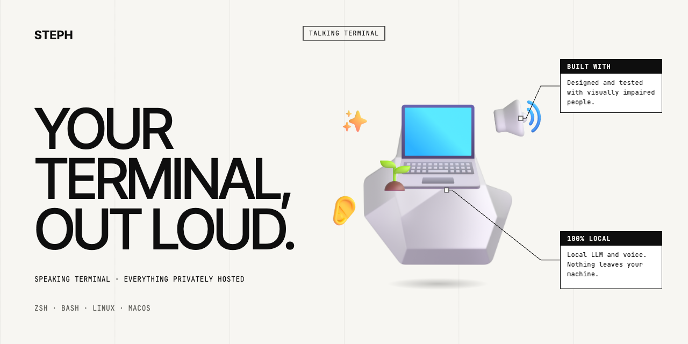

<p align="center">
  <a href="https://steph.lsmdx.com/en/"></a>
</p>

<p align="center">
  <a href="LICENSE.md"></a>
  
  
  <a href="https://steph.lsmdx.com/en/"></a>
</p>

<p align="center"><strong>English</strong> · <a href="README.fr.md">Français</a></p>

# steph, the talking terminal

**S**peaking **T**erminal, **E**verything **P**rivately **H**osted.

> Your build fails. A screen reader reads you 40 lines of stack trace, one by one.
> steph says: *"TypeScript error: property titel does not exist, use title."*

`steph` starts your shell (zsh or bash, with your usual configuration) and
listens to everything that goes through it. Instead of reading every line
aloud, it says **what matters, in one sentence**. Designed and tested with
visually impaired people.

> **September 2026**: steph speaks **French** today; an English voice is the next
> milestone. The examples below are translated. Source available: free for
> individuals, [licensed](COMMERCIAL.md) for companies.

- `ls /usr` → reads the output as is (it is short);
- `cat /nope` → "Error 1: cat: /nope: no such file or directory";
- a failing `npm run build` → "TypeScript error: property titel does not exist, use title.";
- `apt upgrade` → "Running: upgrading packages." … "35 percent, unpacking vim-common." … "Done in 1 minute 24. 12 packages upgraded.";
- a `[Y/n]` prompt → "Question: 24 MB of additional disk space will be used. Do you want to continue? yes or no, yes by default";
- `ssh`, `python`, `psql`… → reads the answer to each command typed inside.

Everything runs **locally**: a small LLM (Gemma 4 E2B via llama.cpp, on the
GPU) and Piper speech synthesis. Nothing leaves the machine. 4 GB of VRAM is
enough, and a question about the whole session is answered in about 1 second.

Hear the voice: [steph.lsmdx.com](https://steph.lsmdx.com/en/#listen).

## Install

```sh
curl -fsSL https://steph.lsmdx.com/install | sh
steph
```

About 3 GB to download (model and voice). The script clones the repository into
`~/.local/share/steph/src`, installs `uv` if needed, then runs `scripts/install.sh`.

Or by hand:

```sh
git clone https://github.com/tutozz/steph && cd steph
./scripts/install.sh      # llama.cpp + model (~3 GB) + voice + steph command
steph                     # start the talking terminal
```

Requirement: `uv` ([install](https://docs.astral.sh/uv/)). No admin rights needed.

**Linux**: PipeWire or PulseAudio (`paplay`). An NVIDIA card is used when
present (4 GB is enough), otherwise Vulkan, otherwise CPU.

**macOS** (Apple Silicon or Intel):

```sh
brew install uv llama.cpp sox   # sox: snappier voice (afplay otherwise, built in)
./scripts/install.sh
steph
```

- The model runs on the GPU through Metal (Homebrew llama.cpp, or the official
  binary when Homebrew is missing).
- On a Mac, F7 to F10 are media keys: hold **fn**, or turn on "Use F1, F2, etc.
  keys as standard function keys" (Settings → Keyboard). Other keys can be set
  in `config.toml`.
- The question window (F7) opens in Terminal.app, or in iTerm when `steph`
  runs in iTerm.
- Without Piper, `steph` falls back to the system `say` voice ("Thomas", change
  it with `STEPH_MAC_VOICE`).

## Keys and commands

| Key / command | Effect |
|---|---|
| **F7** | opens the question window (second terminal) |
| **F8** | instant silence |
| **F9** | repeats the last announcement |
| **F10** | detailed explanation of the last command |
| `q why did it crash?` | quick question, without leaving the shell |
| `q` then Enter | asks at a `?` prompt: quotes and apostrophes need no escaping |
| `steph ask` | question window (in any terminal) |
| `steph ctl stop\|repeat\|details\|status\|history` | remote control of the session |
| `steph say "text"` | test the voice |
| `steph server status\|stop` | the local model |

Questions cover **the whole session history**: commands, exit codes and
output. No need to copy anything.

## How it works

```
keyboard ──► PTY proxy ──► your shell (zsh/bash + markers)
                │  ▲
   output ◄─────┘  │ invisible markers: command start, end + exit code
                ▼
          cleaner (ANSI, \r, progress bars, apt status line)
                ▼
          narrator ── deterministic rules (instant) ──┐
                │                                     ├──► Piper ──► speaker
                └── local LLM (summaries, steps, Q&A) ┘
```

- **Deterministic first.** Empty output → "OK"; short output → read as is;
  `cd` → "Folder tmp"; exit code 127 → "Command not found"; percentages and
  known steps (apt, dnf, pip, git, docker, cargo, make…) extracted with
  regular expressions. The LLM only summarises long output or explains an
  error.
- **Speak early.** The LLM answer is read sentence by sentence while it is
  generated. For a long command, "Done in 32 seconds" is said right away while
  the summary is computed.
- **Know when the program waits for you.** `steph` checks whether the
  foreground program is blocked reading the terminal. It tells a real prompt
  apart from a command typed ahead.
- **Fast questions thanks to the cache.** History is built append-only and
  pre-computed while the GPU is idle (cancellable warm-up). A question only
  costs its own words: about 1 s instead of 20 to 30 s.
- **Robust.** If the model crashes, `steph` restarts it and uses a
  deterministic summary meanwhile.

## Model choice (measured on an NVIDIA T600, 4 GB)

| Model | Mean summary latency | Quality |
|---|---|---|
| Qwen3.5 0.8B | 0.6 s | makes things up |
| LFM2.5 1.2B | 1.1 s | telegraphic, not very useful |
| Qwen3.5 2B | 1.1 s | fair, a few mistakes |
| **Gemma 4 E2B** (default) | 1.5 s | factual, best at Q&A |
| granite 4.2 3B | 2.8 s | precise, leaks `</think>` |
| Qwen3.5 4B | 3.2 s | the best, too slow |

Reproducible benchmark: `bench/bench.py` (real fixtures in `bench/`).

## Configuration

See `config.example.toml` → `~/.config/steph/config.toml`.

`llama-server` settings (parallelism, batch size, flash attention, cache
type…) auto-adapt to the detected GPU: run `steph profile` to see the
detected hardware and the command that would be launched. Details and how to
contribute a profile for an unrecognised card: `src/steph/profiles/README.md`
(in French).

## Tests

GitHub Actions (`.github/workflows/ci.yml`) runs the tests on Ubuntu and
macOS, with zsh and bash (including macOS bash 3.2), plus an end-to-end LLM
test on a Mac with Homebrew llama.cpp.

```sh
uv run pytest tests               # unit tests (cleaner, markers, steps)
uv run python tests/e2e.py basic  # end to end, voice muted, speech log
#   scenarios: basic long prompt repl subshell ask keys real typeahead
```

Logs: `$XDG_RUNTIME_DIR/steph/steph.log` and `llama-server.log`.

## Known limits

- Full-screen apps (vim, htop, less) are not read: `steph` only announces
  that they are open.
- Enter typed ahead is handled, but arrow keys inside a line being edited are
  only filtered approximately.
- The small model sometimes miscounts, for example "50 numbers" instead of 60.
  F10 and questions give more detail.

## License

| Use | License | Price |
|---|---|---|
| Individuals, study, hobby projects | [PolyForm Noncommercial 1.0.0](LICENSE.md) | free |
| Nonprofits, schools, public research, government | [PolyForm Noncommercial 1.0.0](LICENSE.md) | free |
| Companies, contractors, embedding in a product | [commercial license](COMMERCIAL.md) | quote on request |

The source code is open and can be modified. Any commercial use requires a
commercial license: write to [luis@lsmdx.com](mailto:luis@lsmdx.com).

3D icons on the website and banner: [Microsoft Fluent Emoji](https://github.com/microsoft/fluentui-emoji) (MIT).
